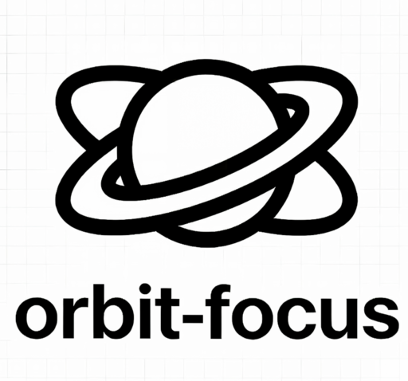

<div align="center">
  
  <h1>Orbit Focus</h1>
  <p><strong>一款专为极客与开发者打造的跨平台桌面番茄钟应用</strong></p>

  <p>
    <a href="README.md">简体中文</a> |
    <a href="README_en.md">English</a> |
    <a href="README_ru.md">Русский</a>
  </p>

  <!-- Badges -->
  <p>
    
    
    
    
    
    
  </p>
</div>

---

## 项目简介

Orbit Focus 是一款基于现代 Web 技术栈 (React + Electron) 构建的全栈跨平台番茄钟应用。它不仅提供了核心的时间管理与任务规划能力，更通过深度整合开发者工作流（如代码打字测速练手、WakaTime 数据联动等），致力于为程序员提供极致的专注体验与生产力提升。

## 界面预览

|  |  |
|:---:|:---:|
| 主界面 / 时钟 | 专注倒计时 |

|  |  |
|:---:|:---:|
| 编码数据面板 | 代码打字测速 |

|  |  |
|:---:|:---:|
| 专注统计热力图 | 偏好设置 |

|  |
|:---:|
| 任务管理清单 |


## 核心特性

- **专业时间管理**：支持标准的番茄工作法（专注、短休、长休）及正计时模式。
- **轻量任务跟踪**：内置支持 CRUD 操作的任务清单，确保每次专注都有明确目标。
- **深度统计洞察**：可视化展示每日、每周专注时长与分布。
- **国际化支持**：原生支持中文、English 及 Русский，无缝切换。
- **本地优先架构**：所有数据均通过 SQLite 安全存储于本地，保护隐私。
- **极客专属功能**：独特的代码打字测速功能 (CodeTypingView)，提高肌肉记忆。
- **扩展性与集成**：提供本地 API 与 WebSocket 服务，为未来的 IDE 插件集成打下基础。

## 技术架构

本项目采用全栈分离的架构设计，确保了良好的可维护性与扩展性：

- **客户端 (Client)**：`React 18` + `Vite` + `Tailwind CSS` + `Framer Motion`，打造丝滑的现代化用户界面。
- **服务端 (Server)**：`Node.js` + `Express` + `better-sqlite3`，提供稳定高效的本地数据持久化与 API 支持。
- **桌面端 (Electron)**：作为宿主环境，打包并桥接深层系统能力（如系统托盘、全局快捷键等）。

## 目录结构

```text
orbit-focus-desktop/
├── client/                 # 前端 React 源码与构建配置
├── server/                 # 后端 Node.js 服务与数据库配置
├── electron/               # Electron 主进程代码与预加载脚本
├── build/                  # 应用打包所需资源（图标等）
├── scripts/                # 构建与开发自动化脚本
├── package.json            # 根项目配置及工作区 (Workspaces) 定义
└── README.md               # 项目说明文档
```

## 快速开始

### 环境依赖

- Node.js (推荐 v18 或以上版本)
- npm (已包含在 Node.js 中)

### 安装配置

1. **克隆项目并安装所有依赖**（得益于 npm workspaces，此命令会同时安装根目录、client 和 server 的依赖）：

```bash
npm run install:all
```

2. **启动开发环境**（此命令会并行启动前端热更新服务和 Electron 进程）：

```bash
npm run dev
```

### 构建与打包

如果你想为你的操作系统生成可执行程序，请运行以下对应命令：

```bash
# 构建全量应用并打包（默认识别当前系统）
npm run electron:build

# 特定平台打包
npm run electron:build:win    # Windows (.exe)
npm run electron:build:mac    # macOS (.dmg)
npm run electron:build:linux  # Linux (.deb, .pkg.tar.zst, AppImage)
```
*所有输出的安装包均会放置在 `dist-electron/` 目录下。*

- **Debian/Ubuntu**: `dist-electron/orbit-focus_1.0.0_amd64.deb`
- **Arch Linux**: `dist-electron/Orbit Focus-1.0.0.pkg.tar.zst` (使用 `pacman -U` 安装)
- **通用 Linux**: `dist-electron/Orbit Focus-1.0.0.AppImage` (赋予执行权限后直接运行)


## API 参考 (内置服务)

Orbit Focus 启动时会在本地启动 RESTful 服务（默认端口：`8080`），供前后台通信或第三方集成使用：

- **任务模块**: `GET/POST/PUT/DELETE /api/tasks` 
- **统计模块**: `GET/POST /api/sessions/stats`
- **系统检查**: `GET /api/health`

## 贡献翻译

如果您希望添加更多语言支持，欢迎 Fork 本仓库并提交 Pull Request。您只需在 `client/src/locales/` 目录下添加对应的 JSON 翻译文件即可。

## 许可证

本项目基于 [MIT](LICENSE) 协议开源。欢迎任何形式的贡献（Pull Request / Issue）。
## 声明

**二次开发说明**：本项目采用 MIT 协议开源，鼓励学习与交流。如需进行二次开发或转载，请务必注明项目原出处。开源不易，请尊重每一位开发者的劳动成果。
