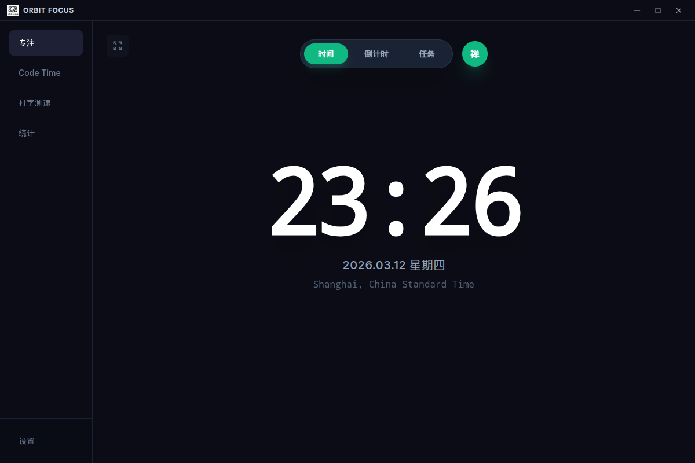
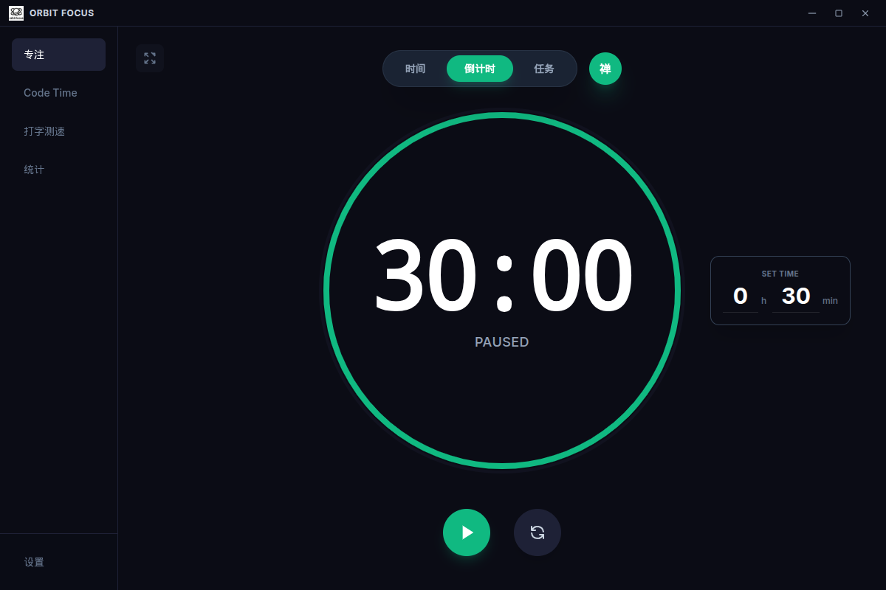
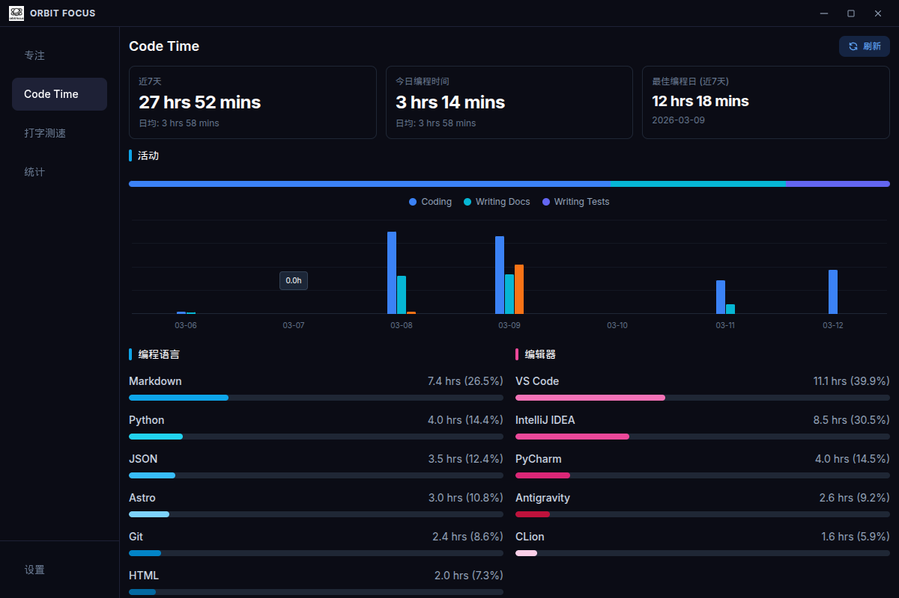
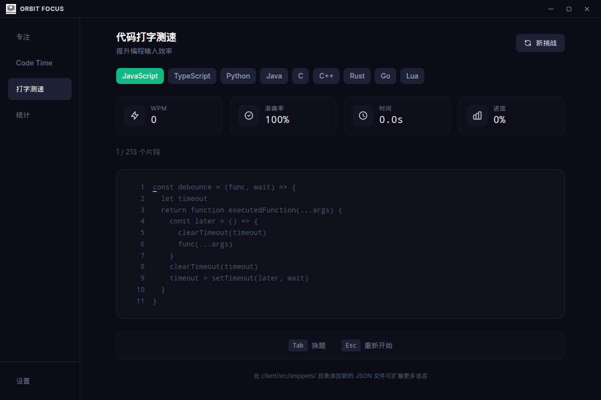
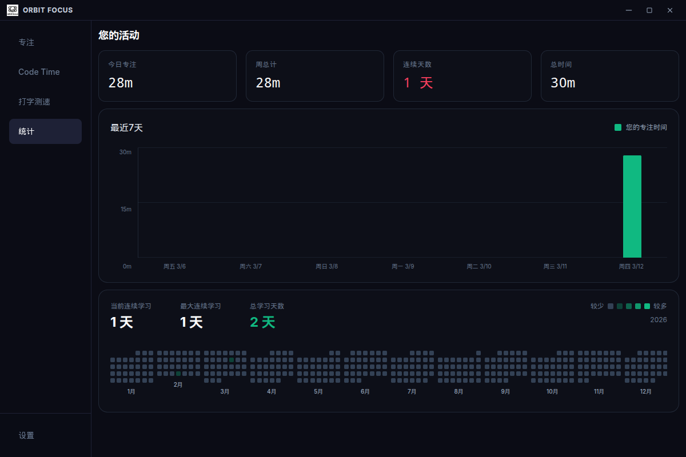
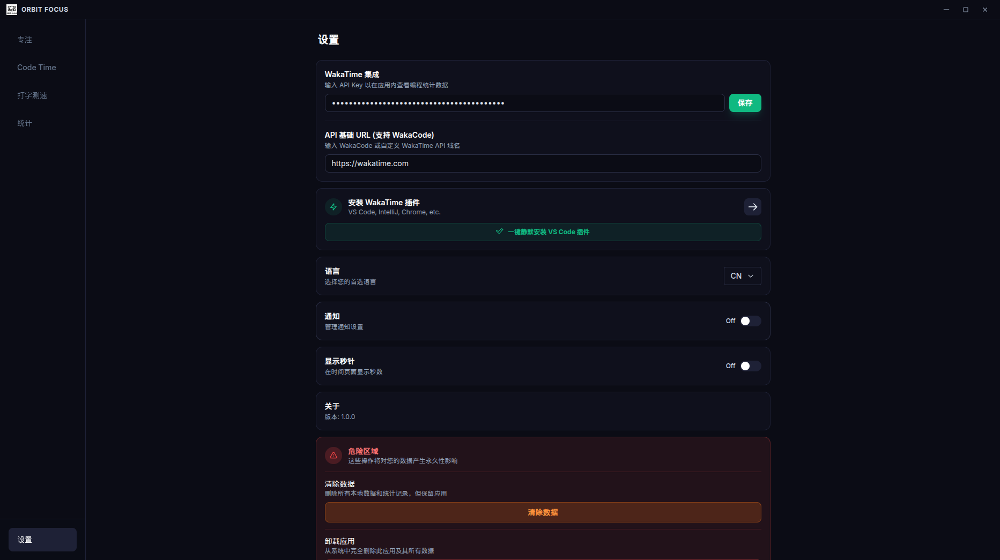
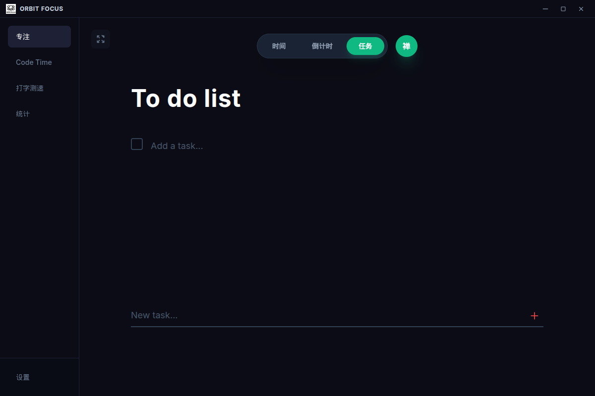

<div align="center">
  
  <h1>Orbit Focus</h1>
  <p><strong>Кроссплатформенное приложение Помодоро для гиков и разработчиков</strong></p>

  <p>
    <a href="README.md">简体中文</a> |
    <a href="README_en.md">English</a> |
    <a href="README_ru.md">Русский</a>
  </p>

  <!-- Badges -->
  <p>
    
    
    
    
    
    
  </p>
</div>

---

## Введение

Orbit Focus — это кроссплатформенное приложение Помодоро (Pomodoro) полного цикла, созданное на основе современных веб-технологий (React + Electron). Оно не только обеспечивает основные возможности управления временем и планирования задач, но также глубоко интегрируется с рабочими процессами разработчиков (например, тренировка скорости набора кода, синхронизация данных WakaTime) для обеспечения максимальной концентрации и повышения производительности программистов.

## Предварительный просмотр интерфейса

|  |  |
|:---:|:---:|
| Главный интерфейс / Часы | Режим таймера / Обратный отсчет |

|  |  |
|:---:|:---:|
| Панель данных кодирования | Тренировка скорости набора кода |

|  |  |
|:---:|:---:|
| Тепловая карта концентрации | Настройки предпочтений |

|  |
|:---:|
| Активная сессия концентрации |


## Основные возможности

- **Профессиональное управление временем**: Поддержка стандартной техники Помодоро (Концентрация, Короткий перерыв, Длинный перерыв) и режима секундомера.
- **Легкое отслеживание задач**: Встроенный список дел с операциями CRUD, обеспечивающий ясную цель для каждого сеанса работы.
- **Глубокая статистика**: Визуализация ежедневной и еженедельной продолжительности и распределения концентрации.
- **Интернационализация**: Встроенная поддержка английского, китайского и русского языков с плавным переключением.
- **Локальная архитектура (Local-first)**: Все данные безопасно хранятся локально через SQLite для защиты вашей конфиденциальности.
- **Эксклюзивные функции для гиков**: Уникальный тест скорости набора кода (CodeTypingView) для улучшения мышечной памяти.
- **Расширяемость и интеграция**: Предоставляет локальный API и службы WebSocket, закладывая основу для будущих интеграций с плагинами IDE.

## Архитектура

В проекте применена разделенная архитектура полного цикла (full-stack) для обеспечения отличной поддерживаемости и расширяемости:

- **Клиент (Client)**: `React 18` + `Vite` + `Tailwind CSS` + `Framer Motion` для плавного и современного пользовательского интерфейса.
- **Сервер (Server)**: `Node.js` + `Express` + `better-sqlite3`, обеспечивающий стабильное локальное хранение данных и поддержку API.
- **Десктоп (Electron)**: Выступает в роли хост-среды, пакетируя и объединяя системные возможности (такие как системный трей, глобальные сочетания клавиш).

## Структура каталогов

```text
orbit-focus-desktop/
├── client/                 # Исходный код React Frontend и конфигурация сборки
├── server/                 # Сервис Node.js Backend и конфигурация БД
├── electron/               # Основной процесс Electron и preload-скрипты
├── build/                  # Ресурсы для сборки приложения (иконки и т.д.)
├── scripts/                # Скрипты автоматизации разработки и сборки
├── package.json            # Корневая конфигурация и определение Workspaces
└── README.md               # Документация проекта
```

## Быстрый старт

### Требования к среде

- Node.js (рекомендуется v18 или выше)
- npm (включен в Node.js)

### Установка

1. **Клонируйте проект и установите все зависимости** (Благодаря npm workspaces, эта команда установит зависимости для корня, клиента и сервера одновременно):

```bash
npm run install:all
```

2. **Запустите среду разработки** (Эта команда параллельно запустит сервер горячей перезагрузки frontend и процесс Electron):

```bash
npm run dev
```

### Сборка и упаковка

Чтобы сгенерировать исполняемое приложение для вашей операционной системы, выполните следующие команды:

```bash
# Полная сборка приложения и его упаковка (автоматическое определение текущей ОС)
npm run electron:build

# Упаковка для определенной платформы
npm run electron:build:win    # Windows (.exe)
npm run electron:build:mac    # macOS (.dmg)
npm run electron:build:linux  # Linux (.deb, .pacman, AppImage)
```
*Все выходные установщики будут помещены в каталог `dist-electron/`.*

## Справочник API (Встроенный сервис)

При запуске Orbit Focus загружает локальный сервис RESTful (порт по умолчанию: `8080`) для связи frontend-backend или сторонней интеграции:

- **Задачи (Tasks)**: `GET/POST/PUT/DELETE /api/tasks` 
- **Статистика (Stats)**: `GET/POST /api/sessions/stats`
- **Проверка состояния (Health)**: `GET /api/health`

## Вклад в перевод

Если вы хотите добавить поддержку других языков, пожалуйста, форкните этот репозиторий и отправьте Pull Request. Вы можете просто добавить соответствующие файлы перевода JSON в каталог `client/src/locales/`.

## Лицензия

Этот проект лицензирован в соответствии с [Лицензией MIT](LICENSE). Мы всегда рады любым формам вклада (Pull Requests / Issues).
